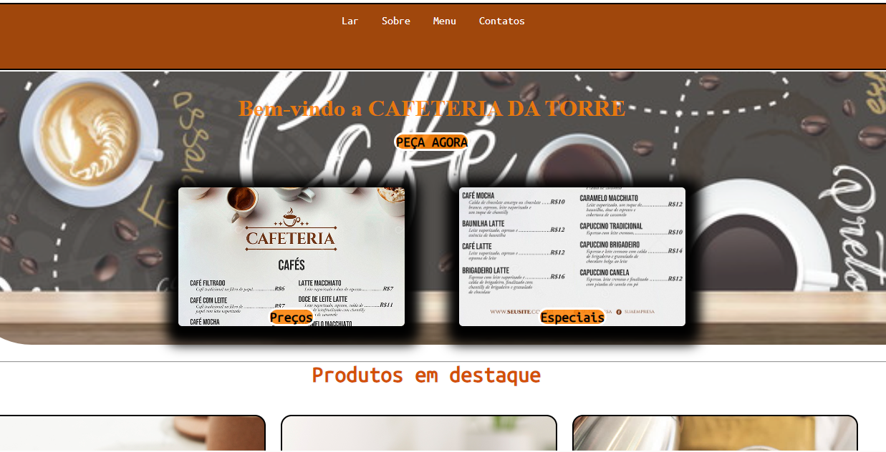

# cafeteria

## descricao 
trabalho onde estiliza o site da cafeteria

## objetivos
 * cria um site para vender cafe

## tecnologias utilizadas 
* CSS
* Java script
* git hub
* geeksforgeeks

## desenvolvedor

* francisco augusto

# capa do projeto

 

## fontes consultadas

https://www.geeksforgeeks.org/design-a-webpage-for-online-food-delivery-system-using-html-and-css/
